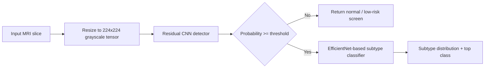
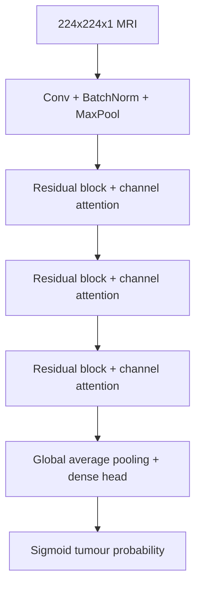
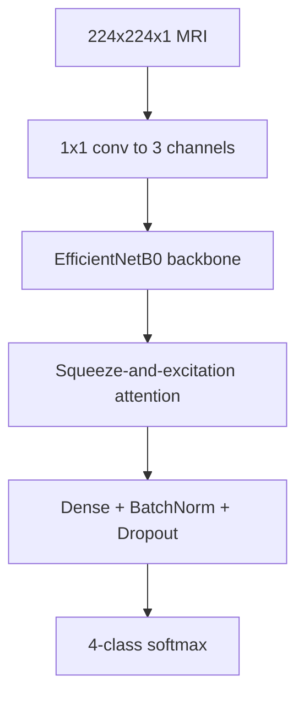
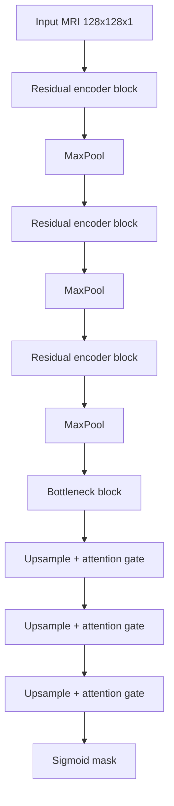
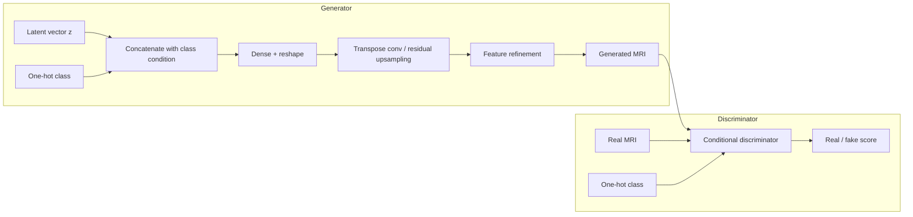
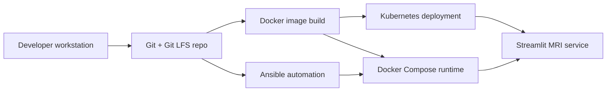

# Architecture Diagrams

## 1. Flagship Screening Pipeline

## 2. Core Detection Model

## 3. Core Classification Model

## 4. Experimental Segmentation Track

## 5. Experimental Conditional GAN

## 6. Deployment Topology

